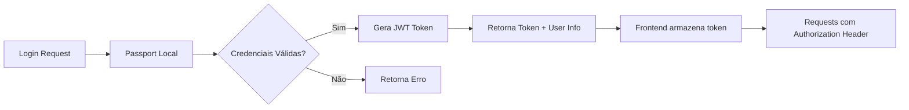

# Block DNS 🛡️

Sistema avançado de gerenciamento de domínios bloqueados para servidor DNS com interface web moderna e funcionalidades administrativas completas.


## 📋 Sobre o Projeto

O Block DNS é uma solução completa e moderna para gerenciamento de domínios bloqueados em servidores DNS. O sistema oferece uma interface web intuitiva construída com React 19 e Material-UI, com funcionalidades avançadas de administração, geração automática de arquivos de zona RPZ (Response Policy Zone) e sistema robusto de gerenciamento de usuários com autenticação JWT.

### ✨ Principais Funcionalidades

#### 🔐 Sistema de Autenticação & Autorização
- Login seguro com JWT e gerenciamento de sessões
- Middleware de autenticação com Passport.js (Local + JWT)
- Rotas protegidas e controle de acesso
- Logout seguro com invalidação de tokens

#### 👥 Gerenciamento Completo de Usuários
- Criação, edição e remoção de usuários
- Validação de unicidade de username e email
- Criptografia de senhas com bcryptjs
- Painel administrativo para gerenciar usuários

#### 📝 CRUD Avançado de Domínios
- Adição individual ou em lote de domínios
- Validação e normalização automática de URLs
- Edição inline de domínios existentes
- Remoção com confirmação e feedback visual
- Verificação de duplicatas

#### � Sistema de Busca & Paginação
- Busca em tempo real com debounce (500ms)
- Paginação inteligente com controles customizados
- Ordenação por múltiplos campos (ID, URL, data)
- Filtros dinâmicos e persistentes
- Navegação eficiente em grandes conjuntos de dados

#### 🗃️ Geração Automática de Arquivos RPZ
- Geração de arquivos de zona DNS otimizados
- Serial automático baseado em data (YYYYMMDD)
- Configuração TTL personalizável
- Redirecionamento configurável via variáveis de ambiente
- Transferência automática via SCP para servidores DNS

#### 🎨 Interface Moderna & Responsiva
- Design moderno com Material-UI v7
- Componentes customizados e reutilizáveis
- Loading states e feedback visual
- Modo de adição single/multiple domains
- Spinners de carregamento personalizados

#### 🔄 Funcionalidades Avançadas
- Atualizações em tempo real após operações
- Sistema de notificações e alertas
- Context API para gerenciamento de estado global
- Custom hooks para lógica reutilizável
- Hot reload para desenvolvimento

## 🛠️ Stack Tecnológico

### Backend (Node.js + TypeScript)
- **Node.js 18+** - Runtime JavaScript moderno
- **TypeScript 5.8** - Tipagem estática e recursos avançados
- **Express.js 4.18** - Framework web minimalista e flexível
- **PostgreSQL 12+** - Banco de dados relacional robusto
- **Passport.js** - Middleware de autenticação (Local + JWT strategies)
- **JWT (jsonwebtoken)** - Tokens de autenticação seguros
- **bcryptjs** - Criptografia de senhas com salt
- **CORS** - Controle de acesso entre origens
- **dotenv** - Gerenciamento de variáveis de ambiente
- **pg** - Cliente PostgreSQL para Node.js

### Frontend (React + TypeScript)
- **React 19** - Biblioteca UI com recursos mais recentes
- **TypeScript 5.8** - Tipagem estática para JavaScript
- **Vite 7.x** - Build tool ultrarrápida com HMR
- **React Router v7** - Roteamento SPA de nova geração
- **Material-UI v7** - Componentes React modernos e acessíveis
- **Emotion** - CSS-in-JS para estilização
- **Axios** - Cliente HTTP promise-based
- **Context API** - Gerenciamento de estado global nativo
- **Custom Hooks** - Lógica reutilizável e modular

### Ferramentas de Desenvolvimento
- **TSX** - Execução TypeScript com hot reload
- **Nodemon** - Monitor de arquivos para desenvolvimento
- **ESLint** - Linting e análise de código
- **Concurrently** - Execução paralela de scripts
- **Vite Dev Server** - Servidor de desenvolvimento com HMR

### Arquitetura & Padrões
- **Arquitetura MVC** - Separação clara de responsabilidades
- **RESTful API** - Design de API padronizada
- **Middleware Pattern** - Interceptadores de requisições
- **Repository Pattern** - Abstração de acesso a dados
- **Custom Hooks Pattern** - Reutilização de lógica no React
- **Context Provider Pattern** - Compartilhamento de estado

## 🗄️ Estrutura do Banco de Dados

### Tabela: `users`
```sql
CREATE TABLE IF NOT EXISTS users (
    id SERIAL PRIMARY KEY,
    username VARCHAR(50) NOT NULL UNIQUE,
    email VARCHAR(120) NOT NULL UNIQUE,
    password VARCHAR(255) NOT NULL,
    created_at TIMESTAMPTZ DEFAULT NOW()
);
```

### Tabela: `domains`
```sql
CREATE TABLE IF NOT EXISTS domains (
    id SERIAL PRIMARY KEY,
    url TEXT NOT NULL UNIQUE
);
```

### Índices para Performance
```sql
-- Índices auxiliares para otimização de consultas
CREATE INDEX IF NOT EXISTS idx_domains_url ON domains (url);
CREATE INDEX IF NOT EXISTS idx_users_username ON users (username);
CREATE INDEX IF NOT EXISTS idx_users_email ON users (email);
```

### Características do Schema
- **Idempotência**: Scripts podem ser executados múltiplas vezes
- **Constraints**: Unicidade garantida para usernames, emails e URLs
- **Timestamps**: Rastreamento automático de criação com timezone
- **Performance**: Índices otimizados para buscas frequentes
- **Flexibilidade**: URLs como TEXT para suportar domínios longos

## 🚀 Instalação e Configuração

### Pré-requisitos
- Node.js >= 18.0.0
- PostgreSQL >= 12.0
- npm ou yarn

### 1. Clone o repositório
```bash
git clone https://github.com/RLisson/Block-DNS.git
cd Block-DNS
```

### 2. Instale as dependências
```bash
npm run install:all
```

### 3. Configuração do banco de dados

Crie um banco PostgreSQL e execute o script de inicialização:

```bash
# Crie o banco de dados
createdb block_dns

# Execute o script de inicialização
cd backend
npm run db:init:sql
```

### 4. Configure as variáveis de ambiente

#### Backend (.env)
```bash
# Servidor
PORT=3001
NODE_ENV=development

# Database
DB_HOST=localhost
DB_PORT=5432
DB_NAME=block_dns
DB_USER=seu_usuario
DB_PASSWORD=sua_senha

# API
API_VERSION=v1
CORS_ORIGIN=http://localhost:5173

# Autenticação
JWT_SECRET=seu_jwt_secret_muito_seguro_min_32_chars
JWT_EXPIRES_IN=24h

# DNS/RPZ
DNS_RPZ_PATH=/var/named/
REDIRECT=localhost

# SCP (opcional - para transferência automática)
SCP_HOST=seu_servidor_dns
SCP_USER=usuario_scp
SCP_KEY_PATH=/caminho/para/chave_ssh
```

#### Frontend (.env)
```bash
VITE_BACKEND_URL=http://localhost:3001/api/v1
```

### 5. Inicialização do banco de dados

```bash
# Opção 1: Script SQL direto
npm run db:init:sql

# Opção 2: Script TypeScript (build + execução)
npm run db:init
```

### 6. Inicie o projeto

```bash
# Desenvolvimento (backend + frontend simultaneamente)
npm run dev

# Ou execute separadamente:
npm run dev:backend   # Backend na porta 3001
npm run dev:frontend  # Frontend na porta 5173

# Produção
npm run build        # Build do frontend
npm run start        # Inicia backend em produção
```

## 📁 Estrutura Detalhada do Projeto

```
Block DNS/
├── backend/                    # Servidor Node.js + TypeScript
│   ├── src/
│   │   ├── config/            # Configurações do sistema
│   │   │   ├── database.ts    # Conexão PostgreSQL
│   │   │   ├── environment.ts # Variáveis de ambiente
│   │   │   ├── passport.ts    # Estratégias de autenticação
│   │   │   └── rpz-zone.ts    # Geração de arquivos RPZ
│   │   ├── controllers/       # Controladores da API REST
│   │   │   └── domainController.ts # CRUD + RPZ + Paginação
│   │   ├── middlewares/       # Middlewares Express
│   │   │   └── auth.ts        # Autenticação JWT
│   │   ├── models/            # Modelos de dados
│   │   │   ├── domainModel.ts # Operações de domínio
│   │   │   └── userModel.ts   # Operações de usuário
│   │   ├── routes/            # Definição de rotas
│   │   │   ├── authRoutes.ts  # Rotas de autenticação
│   │   │   └── domainRoutes.ts # Rotas de domínios
│   │   ├── services/          # Lógica de negócio
│   │   │   ├── domainService.ts # Validação e normalização
│   │   │   └── scpService.ts   # Transferência SCP
│   │   ├── scripts/           # Scripts utilitários
│   │   │   └── initDatabase.ts # Inicialização do BD
│   │   ├── types/             # Definições TypeScript
│   │   │   ├── database.ts    # Tipos do banco
│   │   │   ├── domain.ts      # Tipos de domínio
│   │   │   ├── environment.ts # Tipos de config
│   │   │   └── user.ts        # Tipos de usuário
│   │   ├── app.ts             # Configuração Express
│   │   └── server.ts          # Inicialização do servidor
│   ├── init-db.sql           # Script SQL de inicialização
│   ├── db.rpz.zone          # Arquivo RPZ gerado
│   ├── package.json         # Dependências backend
│   └── tsconfig.json        # Configuração TypeScript
│
├── front/                     # Interface React + TypeScript
│   ├── src/
│   │   ├── assets/           # Recursos estáticos
│   │   │   ├── config.svg    # Ícone de configurações
│   │   │   ├── logout.svg    # Ícone de logout
│   │   │   └── trash.svg     # Ícone de exclusão
│   │   ├── auth/             # Utilitários de autenticação
│   │   │   └── index.ts      # Helpers de auth
│   │   ├── components/       # Componentes reutilizáveis
│   │   │   ├── AuthProvider.tsx       # Provider de autenticação
│   │   │   ├── Button.tsx            # Botão customizado
│   │   │   ├── Header.tsx            # Cabeçalho com navegação
│   │   │   ├── ListItem.tsx          # Item de lista editável
│   │   │   ├── LoadingSpinner.tsx    # Indicador de carregamento
│   │   │   ├── MultipleDomains.tsx   # Input múltiplos domínios
│   │   │   ├── PaginationControls.tsx # Controles de paginação
│   │   │   ├── ProtectedRoute.tsx    # Rota protegida
│   │   │   └── SingleDomain.tsx      # Input único domínio
│   │   ├── contexts/         # Contextos React
│   │   │   └── AuthContext.ts # Contexto de autenticação
│   │   ├── hooks/            # Hooks customizados
│   │   │   ├── useAuth.ts    # Hook de autenticação
│   │   │   ├── useDomains.ts # Hook de domínios
│   │   │   ├── usePagination.ts # Hook de paginação
│   │   │   └── useUsers.ts   # Hook de usuários
│   │   ├── pages/            # Páginas da aplicação
│   │   │   ├── AddDomains.tsx    # Adicionar domínios
│   │   │   ├── Config.tsx        # Configurações
│   │   │   ├── CreateUser.tsx    # Criar usuário
│   │   │   ├── Login.tsx         # Página de login
│   │   │   ├── ManageUsers.tsx   # Gerenciar usuários
│   │   │   └── ViewDomains.tsx   # Visualizar domínios
│   │   ├── services/         # Serviços de API
│   │   │   ├── api.ts            # Cliente Axios configurado
│   │   │   ├── authService.ts    # Serviços de autenticação
│   │   │   └── domainService.ts  # Serviços de domínio
│   │   ├── types/            # Tipos TypeScript
│   │   │   ├── auth.ts       # Tipos de autenticação
│   │   │   └── domain.ts     # Tipos de domínio
│   │   ├── App.tsx           # Componente raiz
│   │   ├── main.tsx         # Ponto de entrada
│   │   ├── main.css         # Estilos globais
│   │   └── vite-env.d.ts    # Tipos Vite
│   ├── index.html           # Template HTML
│   ├── package.json        # Dependências frontend
│   ├── tsconfig.json       # Config TypeScript principal
│   ├── tsconfig.app.json   # Config TypeScript app
│   ├── tsconfig.node.json  # Config TypeScript Node
│   ├── vite.config.ts      # Configuração Vite
│   └── eslint.config.js    # Configuração ESLint
│
├── package.json            # Scripts monorepo
└── README.md              # Documentação
```

## 🔧 Scripts e Comandos Disponíveis

### Scripts Principais (Raiz do Projeto)
```bash
# Desenvolvimento
npm run dev                 # Inicia backend + frontend simultaneamente
npm run dev:backend        # Apenas backend (porta 3001)
npm run dev:frontend       # Apenas frontend (porta 5173)

# Instalação
npm run install:all        # Instala dependências backend + frontend

# Produção
npm run start              # Inicia backend em produção
npm run build              # Build do frontend para produção
```

### Scripts Backend (./backend)
```bash
# Desenvolvimento
npm run dev                 # Nodemon com tsx
npm run dev:watch          # TSX em modo watch

# Build e Produção
npm run build              # Compila TypeScript para ./dist
npm run start              # Executa versão compilada

# Banco de Dados
npm run db:init            # Build + executa script de inicialização
npm run db:init:sql        # Executa SQL direto no PostgreSQL

# Testes
npm test                   # Executa testes Jest
```

### Scripts Frontend (./front)
```bash
# Desenvolvimento
npm run dev                # Vite dev server com HMR

# Build e Deploy
npm run build              # Build para produção (TypeScript + Vite)
npm run preview            # Preview da build de produção

# Qualidade de Código
npm run lint               # ESLint para análise de código
```

### Comandos Úteis para Desenvolvimento
```bash
# Limpar builds
rm -rf backend/dist front/dist

# Verificar portas em uso
lsof -i :3001              # Backend
lsof -i :5173              # Frontend

# Logs em tempo real
tail -f backend/logs/*.log  # Se houver logging em arquivo
```

## 🌐 API Reference

### 🔐 Autenticação (`/api/v1/auth`)

#### POST `/auth/login`
```json
// Request
{
  "username": "admin",
  "password": "password123"
}

// Response (200)
{
  "message": "Login realizado com sucesso",
  "token": "eyJhbGciOiJIUzI1NiIsInR5cCI6IkpXVCJ9...",
  "user": {
    "id": 1,
    "username": "admin",
    "email": "admin@example.com"
  },
  "authenticated": true
}
```

#### POST `/auth/register`
```json
// Request
{
  "username": "newuser",
  "email": "user@example.com",
  "password": "securepassword"
}

// Response (201)
{
  "message": "Usuário criado com sucesso",
  "user": {
    "id": 2,
    "username": "newuser",
    "email": "user@example.com"
  }
}
```

#### Outras rotas de autenticação:
- `GET /auth/me` - Informações do usuário autenticado (requer token)
- `GET /auth/getAll` - Lista todos os usuários (requer auth)
- `PATCH /auth/update/:id` - Atualiza usuário (requer auth)
- `DELETE /auth/delete/:id` - Remove usuário (requer auth)
- `POST /auth/logout` - Logout (limpa sessão)

### 🌐 Domínios (`/api/v1/domains`)

#### GET `/domains` (com paginação)
```bash
# Parâmetros de query opcionais
?page=1&limit=10&sortBy=id&sortOrder=ASC&searchTerm=example
```

```json
// Response (200)
{
  "success": true,
  "data": [
    {
      "id": 1,
      "url": "example.com",
      "created_at": "2024-01-15T10:30:00Z"
    }
  ],
  "pagination": {
    "page": 1,
    "limit": 10,
    "total": 25,
    "totalPages": 3,
    "hasNext": true,
    "hasPrev": false
  }
}
```

#### POST `/domains`
```json
// Request
{
  "url": "malicious-site.com"
}

// Response (201)
{
  "success": true,
  "data": {
    "id": 2,
    "url": "malicious-site.com",
    "created_at": "2024-01-15T10:35:00Z"
  }
}
```

#### Outras rotas de domínios:
- `GET /domains/search?term=example` - Busca domínios por termo
- `GET /domains/:id` - Busca domínio por ID
- `GET /domains/url/:url` - Busca domínio por URL
- `PUT /domains/:id` - Atualiza domínio por ID
- `PUT /domains/updateByUrl` - Atualiza domínio por URL
- `DELETE /domains/:id` - Remove domínio

### 🗃️ RPZ Zone (`/api/v1/domains`)

#### GET `/domains/rpz`
```json
// Response (200)
{
  "success": true,
  "message": "Arquivo RPZ gerado com sucesso",
  "scp": {
    "success": true,
    "message": "Arquivo transferido via SCP"
  },
  "meta": {
    "steps": [
      {"step": "fetch-domains:start"},
      {"step": "fetch-domains:done", "count": 150},
      {"step": "write-file:start"},
      {"step": "write-file:done"},
      {"step": "scp:start"},
      {"step": "scp:done", "scp": {...}}
    ]
  }
}
```

#### GET `/domains/scp-status`
Status da última transferência SCP:
```json
{
  "success": true,
  "data": {
    "lastTransfer": "2024-01-15T10:40:00Z",
    "status": "success",
    "fileSize": "2048 bytes"
  }
}
```

### 🔒 Autenticação de Rotas
- **Públicas**: `/auth/login`, `/auth/register`
- **Protegidas**: Todas as outras rotas requerem header:
  ```
  Authorization: Bearer <jwt_token>
  ```

## 🔐 Sistema de Autenticação

### Estratégias de Autenticação
O sistema implementa duas estratégias Passport.js:

1. **Local Strategy**: Login com username/password
2. **JWT Strategy**: Validação de tokens para rotas protegidas

### Fluxo de Autenticação


### Middleware de Proteção
```typescript
// Todas as rotas protegidas passam por:
export const requireAuth = passport.authenticate('jwt', { session: false });
```

### Recursos de Segurança
- **Senhas criptografadas** com bcryptjs + salt
- **Tokens JWT** com expiração configurável
- **Validação de unicidade** para username e email
- **Middleware de proteção** para rotas sensíveis
- **Logout seguro** com invalidação de tokens

## 📊 Sistema RPZ (Response Policy Zone)

### Geração Automática de Arquivos DNS
O sistema gera arquivos de zona RPZ compatíveis com servidores DNS como BIND9, Unbound e PowerDNS.

#### Estrutura do Arquivo RPZ
```dns
$TTL 1H
@       IN      SOA     LOCALHOST. localhost.localhost. (
                        2024011501 ; serial (auto-generated)
                        1h         ; refresh (1 hour)
                        15m        ; retry (15 minutes)
                        30d        ; expire (30 days)
                        2h         ; minimum (2 hours)
                        )
                NS      localhost.

; Blocked domains
malicious-site.com     IN CNAME .
suspicious-domain.org  IN CNAME .
```

#### Funcionalidades RPZ
- **Serial automático**: Baseado em data (YYYYMMDDNN)
- **TTL configurável**: Otimizado para performance
- **Redirecionamento flexível**: Via variável REDIRECT
- **Transferência SCP**: Automática para servidores DNS
- **Validação de domínios**: Normalização e verificação
- **Logs detalhados**: Rastreamento de operações

#### Integração com Servidores DNS
```bash
# Exemplo de configuração BIND9
zone "rpz.local" {
    type master;
    file "/var/named/db.rpz.zone";
    allow-query { any; };
};
```

## 🚀 Recursos Avançados

### Hook Personalizado de Paginação
```typescript
const { data, loading, error, pagination, goToPage, nextPage, prevPage } = 
  usePagination<Domain>('/domains', {
    page: 1,
    limit: 10,
    sortBy: 'id',
    sortOrder: 'ASC'
  });
```

### Context API para Estado Global
```typescript
const AuthContext = createContext<AuthContextType>({
  user: null,
  token: null,
  login: async () => false,
  logout: () => {},
  isAuthenticated: false
});
```

### Componentes Reutilizáveis
- **LoadingSpinner**: Múltiplos tamanhos e mensagens customizáveis
- **PaginationControls**: Navegação intuitiva com informações detalhadas
- **ListItem**: Edição inline com estados de loading
- **ProtectedRoute**: HOC para proteção de rotas

## 🔧 Configurações Avançadas

### Variáveis de Ambiente Detalhadas
```bash
# Performance e Cache
JWT_EXPIRES_IN=24h                    # Duração do token
CORS_ORIGIN=http://localhost:5173     # Origem permitida

# RPZ Zone
DNS_RPZ_PATH=/var/named/              # Caminho do arquivo RPZ
REDIRECT=localhost                    # Redirecionamento DNS

# SCP Transfer (Opcional)
SCP_HOST=dns.example.com              # Servidor DNS remoto
SCP_USER=dnsadmin                     # Usuário SCP
SCP_KEY_PATH=/home/user/.ssh/id_rsa   # Chave SSH privada
SCP_REMOTE_PATH=/var/named/           # Caminho remoto
```

### Configuração TypeScript
```json
// tsconfig.json (Backend)
{
  "compilerOptions": {
    "target": "ES2022",
    "module": "ESNext",
    "moduleResolution": "node",
    "strict": true,
    "esModuleInterop": true
  }
}
```

## 🧪 Desenvolvimento e Debug

### Logs Estruturados
```typescript
// Middleware de logging personalizado
app.use((req, res, next) => {
  const start = Date.now();
  res.on('finish', () => {
    const ms = Date.now() - start;
    console.log(`[REQ] ${req.method} ${req.originalUrl} -> ${res.statusCode} (${ms}ms)`);
  });
  next();
});
```

### Hot Reload Configurado
- **Backend**: Nodemon + TSX para recompilação automática
- **Frontend**: Vite HMR para atualizações instantâneas
- **Ambiente concorrente**: Scripts paralelos com feedback visual

## 🤝 Contribuição

Contribuições são muito bem-vindas! Para contribuir:

1. **Fork** o repositório
2. **Crie** uma branch para sua feature
   ```bash
   git checkout -b feature/nova-funcionalidade
   ```
3. **Commit** suas mudanças com mensagens claras
   ```bash
   git commit -m 'feat: adiciona busca avançada de domínios'
   ```
4. **Push** para sua branch
   ```bash
   git push origin feature/nova-funcionalidade
   ```
5. **Abra** um Pull Request detalhado

### Diretrizes de Contribuição
- Siga os padrões de código existentes
- Adicione testes para novas funcionalidades
- Mantenha a documentação atualizada
- Use commits semânticos (feat, fix, docs, etc.)

## 📝 Roadmap

- [ ] **Tema Dark/Light**: Alternância de temas na interface
- [ ] **Importação CSV**: Upload em lote de domínios via arquivo
- [ ] **Webhooks**: Notificações para sistemas externos

## � Licença

Este projeto está licenciado sob a **ISC License** - veja o arquivo LICENSE para detalhes.

## �👨‍💻 Autor

**RLisson** - Desenvolvedor Full Stack  
[](https://github.com/RLisson)


---

<div align="center">
  <p>🛡️ <strong>Feito com ❤️ para melhorar a segurança de redes</strong> 🛡️</p>
  <p>⭐ <strong>Se este projeto foi útil, considere dar uma estrela!</strong> ⭐</p>
  
  
  
  
</div>